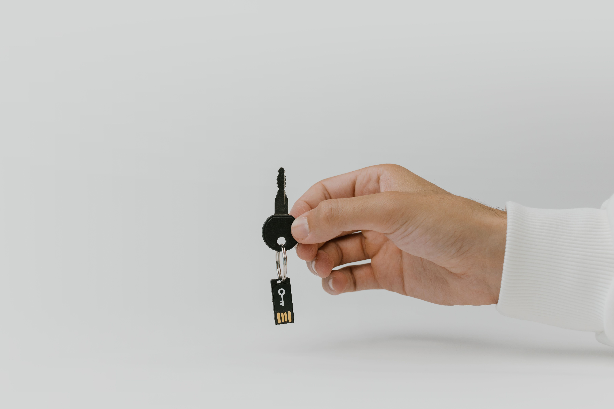
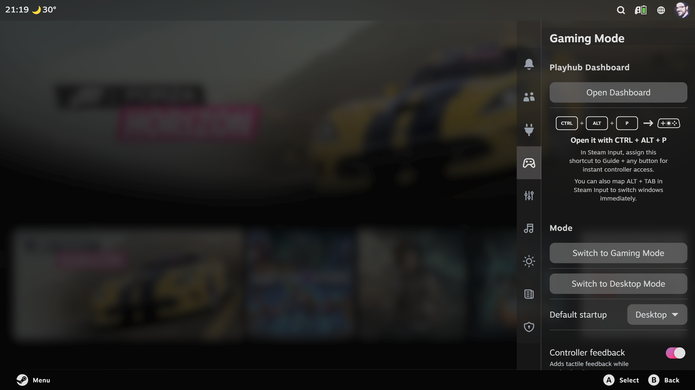
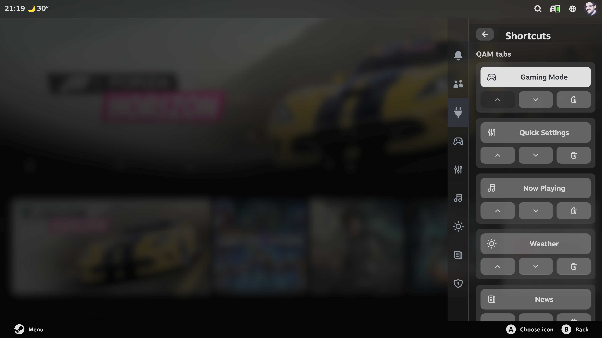
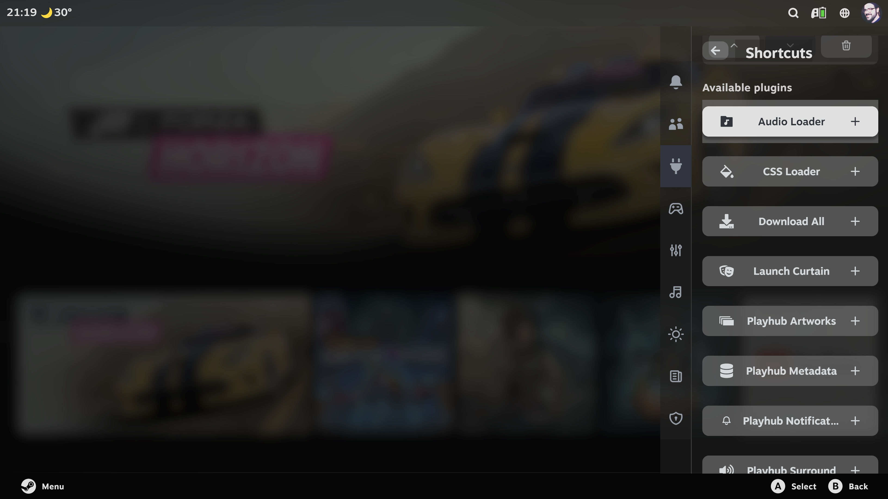
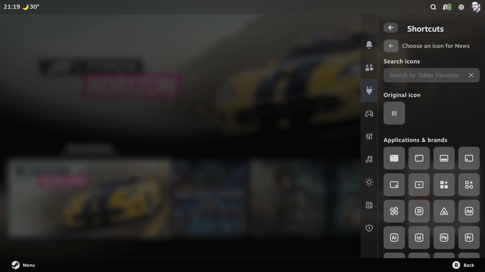

<div align="center">

# Shortcuts

### Your favourite Decky plugins, one tab away.

Turn the Decky panels you use most into independent tabs, then arrange them together with Steam's own Quick Access Menu tabs.

[](https://github.com/LoZazaMastro/Shortcuts/releases/latest)
[](LICENSE)

</div>



## Put your plugins where you need them

Shortcuts brings compatible Decky plugin panels directly into the main Quick Access Menu tab bar. Your original Decky entries stay available, while the panels you choose become immediately accessible beside Steam's native tabs.



## Make the QAM yours

- Add any loaded Decky plugin that exposes a QAM panel.
- Reorder Steam's native tabs, Decky's tab, compatible custom tabs and the shortcuts you create from one list.
- Remove a shortcut without disabling or uninstalling its plugin.
- Keep the original plugin entry available inside Decky.
- Use the plugin's original icon or choose from the bundled Tabler icon library.
- Restore saved shortcuts automatically when a disabled or temporarily unavailable plugin returns.
- Apply QAM and plugin changes from live events, with a low-frequency safety check only as a fallback.
- Follow Steam's interface language automatically, with English as the fallback.



## Add and customise shortcuts

Open Shortcuts in Decky and select a compatible plugin from the available list. The QAM list lets you move native and custom tabs with the controller. Select a shortcut's name to choose its icon, or use the controls below it to move or remove it.





## Requirements

- Steam in Big Picture mode.
- [Decky Loader](https://decky.xyz) 3.x.
- At least one other Decky plugin with a Quick Access Menu panel.

## Installation

Install or update Shortcuts from the [Playhub Plugin Store](https://github.com/LoZazaMastro/Playhub), or install it manually:

1. Download the installer ZIP from the [latest release](https://github.com/LoZazaMastro/Shortcuts/releases/latest).
2. Enable developer mode in Decky Loader.
3. Open **Decky > Settings > Developer > Install Plugin from ZIP**.
4. Select the downloaded archive.

## Development

The frontend source is deployable JavaScript and is copied to `dist/index.js` by the build script.

```bash
npm run build
npm test
```

On Windows, create the installable archive and the complete project archive with:

```powershell
.\package-win.ps1
```

Shortcuts uses Decky's internal QAM tab registry because Decky does not currently expose a public API for independent top-level tabs or tab ordering. It reuses the live tab objects already created by Steam and Decky and changes only their sequence. Every mutation is validated and rolled back when the expected structure is not present, but a future Steam or Decky update may still require an adjustment.

## License and acknowledgements

Shortcuts is distributed under the [GPL-3.0-only license](LICENSE). Complete third-party notices are available in [THIRD_PARTY_NOTICES.md](THIRD_PARTY_NOTICES.md).

Special thanks to **Juan Diego MaLó ([Hooandee](https://github.com/Hooandee))** for discovering the method used to inject custom tabs into the Quick Access Menu. The QAM registration and render-reconciliation work is adapted from Panel de Control by Hooandee and contributors under GPL-3.0-only.

The icon picker uses [Tabler Icons](https://tabler.io/icons), released under the MIT License. Thank you to the Tabler team and contributors for making such a broad, consistent icon set available. The license notice is included in [LICENSES/Tabler-Icons-MIT.txt](LICENSES/Tabler-Icons-MIT.txt).

Cover photo by [cottonbro studio](https://www.pexels.com/@cottonbro/) from [Pexels](https://www.pexels.com/).

Shortcuts does not package code or assets from the plugins it exposes. It references their already-loaded runtime panels, which remain part of their own installations.

<div align="center">

Created and maintained by **[LoZazaMastro](https://github.com/LoZazaMastro)**.

</div>
